# 🗺️ Configurar Mapa com Supabase

## 📋 Visão Geral

O mapa agora busca dados diretamente do Supabase, usando o CEP dos membros para obter latitude/longitude via API do OpenStreetMap (Nominatim).

---

## 🔧 Configuração Necessária

### 1️⃣ **Obter credenciais do Supabase:**

1. Acesse: [https://supabase.com/dashboard](https://supabase.com/dashboard)
2. Selecione seu projeto
3. Vá em **Settings** → **API**
4. Copie:
   - **Project URL** (ex: `https://abc123.supabase.co`)
   - **anon/public key** (chave pública)

### 2️⃣ **Configurar no arquivo do mapa:**

Abra o arquivo: `public/mapas/mapa.html`

Na **linha 77**, substitua:

```javascript
const SUPABASE_URL = 'https://YOUR_PROJECT.supabase.co';
const SUPABASE_ANON_KEY = 'YOUR_ANON_KEY';
```

Por suas credenciais reais:

```javascript
const SUPABASE_URL = 'https://abc123.supabase.co';  // Sua URL
const SUPABASE_ANON_KEY = 'eyJhbGciOiJIUzI1NiIsInR5cCI6IkpXVCJ9...';  // Sua chave
```

---

## 🗺️ Como Funciona

### Fluxo de Dados:

```mermaid
graph LR
    A[Mapa carrega] --> B[Busca membros no Supabase]
    B --> C[Filtra: campaign = B, status = Ativo, CEP não nulo]
    C --> D[Para cada membro]
    D --> E[Busca coordenadas via CEP]
    E --> F[API Nominatim OpenStreetMap]
    F --> G[Retorna lat/lon]
    G --> H[Cria marcador no mapa]
    H --> I[Adiciona ao cluster]
    I --> J[Exibe todos os marcadores]
```



### Query SQL executada:

```sql
SELECT id, name, couple_name, cep, couple_cep, city, couple_city, status, campaign
FROM members
WHERE campaign = 'B'
  AND status = 'Ativo'
  AND cep IS NOT NULL;
```

---

## 🎯 Funcionalidades

### ✅ **Implementado:**

1. **Busca automática de membros:**
   - Apenas campanha B
   - Apenas membros ativos
   - Apenas com CEP preenchido

2. **Geocodificação por CEP:**
   - Usa API Nominatim (gratuita, sem necessidade de chave)
   - Cache de CEPs para evitar requisições duplicadas
   - Delay entre requisições para não sobrecarregar a API

3. **Marcadores inteligentes:**
   - Jitter (pequeno deslocamento) para evitar sobreposição
   - Clustering automático quando muitos marcadores próximos
   - Popups com nome, cônjuge, cidade e CEP

4. **Loading interativo:**
   - Mostra progresso do carregamento
   - Indica quantos membros foram processados
   - Mensagens de erro caso algo dê errado

5. **Otimizações:**
   - Cache de coordenadas por CEP
   - Processamento em lote
   - Ajuste automático de zoom para mostrar todos os pontos

---

## 📊 Dados Exibidos no Popup

Cada marcador mostra:

```
João Silva
Maria Silva (cônjuge)
São Paulo - SP
CEP: 01310-100
```

---

## 🔒 Segurança

### RLS (Row Level Security):

O mapa usa a **anon key** do Supabase, então precisa que as políticas RLS permitam leitura pública da tabela `members`.

**Verificar RLS:**

```sql
-- Ver políticas atuais
SELECT * FROM pg_policies WHERE tablename = 'members';

-- Se necessário, permitir leitura pública apenas para membros ativos
CREATE POLICY "Permitir leitura pública de membros ativos"
ON members
FOR SELECT
USING (status = 'Ativo');
```

⚠️ **ATENÇÃO:** Isso permite que qualquer pessoa veja os membros ativos. Se não quiser isso, você pode:

1. Criar uma **API Route protegida** no backend
2. Usar **Service Role Key** (mais seguro, mas exposto no HTML)
3. Criar uma **view filtrada** no banco

---

## 🌐 API de Geocodificação

### Nominatim (OpenStreetMap):

- **URL:** `https://nominatim.openstreetmap.org/search`
- **Parâmetros:**
  - `postalcode`: CEP brasileiro
  - `country`: Brazil
  - `format`: json
  - `limit`: 1

**Exemplo de resposta:**

```json
[
  {
    "lat": "-23.5505199",
    "lon": "-46.6333094",
    "display_name": "São Paulo, Região Metropolitana de São Paulo, Brasil"
  }
]
```

### Limitações:

- **Limite de requisições:** ~1 por segundo (respeitado no código)
- **Política de uso:** [https://operations.osmfoundation.org/policies/nominatim/](https://operations.osmfoundation.org/policies/nominatim/)
- **User-Agent obrigatório** (já configurado: `SistemaConectados/1.0`)

---

## 🧪 Testes

### 1️⃣ **Testar no console do navegador:**

```javascript
// Ver quantos membros foram carregados
console.log('Membros no mapa:', markers.getLayers().length);

// Ver cache de CEPs
console.log('CEPs em cache:', Object.keys(cepCache).length);

// Ver bounds do mapa
console.log('Bounds:', markers.getBounds());
```

### 2️⃣ **Verificar dados no Supabase:**

```sql
-- Quantos membros da campanha B têm CEP?
SELECT COUNT(*) 
FROM members 
WHERE campaign = 'B' 
  AND status = 'Ativo' 
  AND cep IS NOT NULL;

-- Ver exemplos de CEPs
SELECT name, cep, couple_cep, city 
FROM members 
WHERE campaign = 'B' 
  AND status = 'Ativo' 
  AND cep IS NOT NULL 
LIMIT 10;
```

---

## 🛠️ Troubleshooting

### Problema: Mapa não carrega

**Soluções:**

1. Abra o Console do navegador (F12)
2. Verifique erros de JavaScript
3. Confirme que SUPABASE_URL e SUPABASE_ANON_KEY estão corretos
4. Verifique se há membros da campanha B com CEP

### Problema: RLS bloqueia acesso

**Erro:** `"new row violates row-level security policy"`

**Solução:**

```sql
-- Criar política de leitura pública
CREATE POLICY "public_read_members"
ON members
FOR SELECT
TO anon
USING (true);
```

### Problema: API Nominatim retorna erro 429 (Too Many Requests)

**Solução:**

1. O código já tem delay de 1 segundo a cada 5 requisições
2. Se necessário, aumente o delay na linha 189:
   ```javascript
   await new Promise(resolve => setTimeout(resolve, 2000)); // 2 segundos
   ```

### Problema: CEP não retorna coordenadas

**Possíveis causas:**

1. CEP inválido ou incompleto
2. CEP muito novo (ainda não no OpenStreetMap)
3. Formato errado do CEP

**Solução:**

```javascript
// Ver quais CEPs não encontraram coordenadas
// (Mensagem aparece no console)
```

---

## 📈 Melhorias Futuras

### Possíveis implementações:

1. **Backend próprio de geocodificação:**
   - Criar tabela `cep_coordinates` no Supabase
   - Popular com CEPs brasileiros
   - Evitar dependência de API externa

2. **Filtros no mapa:**
   - Filtrar por cidade
   - Filtrar por data de cadastro
   - Filtrar por setor

3. **Heatmap:**
   - Visualizar densidade de membros
   - Usar plugin Leaflet.heat

4. **Exportar dados:**
   - Download CSV de membros no mapa
   - Compartilhar link do mapa

5. **Cache persistente:**
   - Salvar coordenadas no localStorage
   - Atualizar apenas quando necessário

---

## 📝 Checklist de Configuração

- [ ] Obter SUPABASE_URL e SUPABASE_ANON_KEY
- [ ] Atualizar credenciais em `public/mapas/mapa.html`
- [ ] Verificar RLS policies da tabela `members`
- [ ] Adicionar imagem `Fundo de tela_2.png` (opcional)
- [ ] Testar como admin da Campanha B
- [ ] Verificar console para erros
- [ ] Confirmar que marcadores aparecem

---

## 🎨 Personalização

### Alterar cores dos marcadores:

```javascript
const marker = L.marker([lat, lon], {
  icon: L.icon({
    iconUrl: 'https://cdn.rawgit.com/pointhi/leaflet-color-markers/master/img/marker-icon-2x-blue.png',
    iconSize: [25, 41],
    iconAnchor: [12, 41]
  })
});
```

### Alterar estilo do popup:

```javascript
const popup = `
  <div style="background: #f0f0f0; padding: 10px; border-radius: 8px;">
    <h3 style="margin: 0; color: #3B82F6;">${membro.name}</h3>
    <p style="margin: 5px 0;">${membro.city}</p>
  </div>
`;
```

---

**Última atualização:** Outubro 2025  
**Versão:** 2.0.0  
**Responsável:** Sistema Conectados

