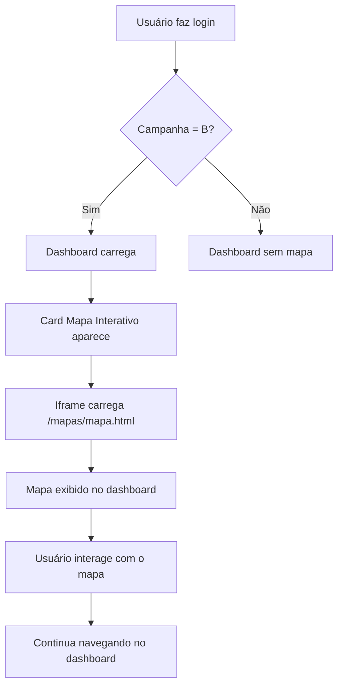

# 🗺️ Mapa Interativo - Campanha B

## 📋 Visão Geral

Sistema de visualização de mapa interativo **integrado ao dashboard** exclusivo para administradores da **Campanha B**.

---

## 🎯 Funcionalidades

### ✅ Implementado:

1. **Card de Mapa no Dashboard**
   - Aparece automaticamente no dashboard para usuários da campanha B
   - Localizado logo abaixo do card "Tipo de Links de Cadastro"
   - Tamanho: 600px de altura
   - Totalmente integrado à interface

2. **Arquivo HTML Customizável**
   - Localização: `public/mapas/mapa.html`
   - Suporta qualquer biblioteca de mapas
   - Carregamento via iframe seguro
   - Atualização em tempo real ao editar o arquivo

---

## 📁 Estrutura de Arquivos

```
sistemaconectados-main-DEV/
├── src/
│   └── pages/
│       └── dashboard.tsx      ← Dashboard com card de mapa integrado
│
└── public/
    └── mapas/
        └── mapa.html           ← SEU ARQUIVO DE MAPA AQUI!
```

---

## 🚀 Como Usar

### 1️⃣ Adicionar seu mapa personalizado:

1. Abra o arquivo: `public/mapas/mapa.html`
2. Substitua o conteúdo pelo HTML do seu mapa
3. Salve o arquivo
4. Faça login como admin da **Campanha B**
5. O mapa aparecerá automaticamente no dashboard, logo abaixo do card "Tipo de Links de Cadastro"

### 2️⃣ Exemplos de integração:

#### **Google Maps:**
```html
<!DOCTYPE html>
<html>
<head>
  <title>Mapa Google</title>
  <style>
    #map { height: 100vh; width: 100%; margin: 0; padding: 0; }
    body { margin: 0; padding: 0; }
  </style>
</head>
<body>
  <div id="map"></div>
  <script>
    function initMap() {
      const map = new google.maps.Map(document.getElementById('map'), {
        center: { lat: -23.5505, lng: -46.6333 },
        zoom: 12
      });
    }
  </script>
  <script src="https://maps.googleapis.com/maps/api/js?key=SUA_CHAVE&callback=initMap"></script>
</body>
</html>
```

#### **Leaflet.js:**
```html
<!DOCTYPE html>
<html>
<head>
  <title>Mapa Leaflet</title>
  <link rel="stylesheet" href="https://unpkg.com/leaflet@1.9.4/dist/leaflet.css" />
  <style>
    #map { height: 100vh; width: 100%; }
    body { margin: 0; padding: 0; }
  </style>
</head>
<body>
  <div id="map"></div>
  <script src="https://unpkg.com/leaflet@1.9.4/dist/leaflet.js"></script>
  <script>
    const map = L.map('map').setView([-23.5505, -46.6333], 13);
    L.tileLayer('https://{s}.tile.openstreetmap.org/{z}/{x}/{y}.png').addTo(map);
  </script>
</body>
</html>
```

#### **Mapbox:**
```html
<!DOCTYPE html>
<html>
<head>
  <title>Mapa Mapbox</title>
  <link href='https://api.mapbox.com/mapbox-gl-js/v2.15.0/mapbox-gl.css' rel='stylesheet' />
  <style>
    #map { height: 100vh; width: 100%; }
    body { margin: 0; padding: 0; }
  </style>
</head>
<body>
  <div id="map"></div>
  <script src='https://api.mapbox.com/mapbox-gl-js/v2.15.0/mapbox-gl.js'></script>
  <script>
    mapboxgl.accessToken = 'SEU_TOKEN';
    const map = new mapboxgl.Map({
      container: 'map',
      style: 'mapbox://styles/mapbox/streets-v12',
      center: [-46.6333, -23.5505],
      zoom: 12
    });
  </script>
</body>
</html>
```

---

## 🔒 Segurança

### Restrições de Acesso:

1. **Verificação de Campanha:**
   - Apenas usuários com `campaign: 'B'` podem acessar
   - Redirecionamento automático para dashboard se não autorizado

2. **Iframe Sandbox:**
   - Sandbox com `allow-scripts` e `allow-same-origin`
   - Isolamento de segurança do conteúdo HTML

3. **Validação de Rota:**
   - Verificação em tempo real no componente
   - Proteção contra acesso direto via URL

---

## 🎨 Personalização

### Modificar o estilo do botão:

Edite em `src/pages/dashboard.tsx`:

```tsx
<Button
  onClick={() => navigate('/mapa')}
  variant="outline"
  className="border-institutional-gold text-institutional-gold hover:bg-institutional-gold/10 flex items-center gap-2"
>
  <MapPin className="w-4 h-4" />
  Mapa
</Button>
```

### Modificar a página de mapa:

Edite em `src/pages/Mapa.tsx` para customizar:
- Header
- Botão "Voltar"
- Estilos do iframe
- Mensagens de erro

---

## 🧪 Testes

### Testar como usuário da Campanha B:

1. Faça login com um usuário que tenha `campaign: 'B'`
2. No dashboard, role a página até o card "Tipo de Links de Cadastro"
3. Logo abaixo, você verá o card "Mapa Interativo"
4. Verifique se o mapa carrega corretamente no iframe
5. Teste a interação com o mapa (zoom, cliques, etc.)

### Testar restrição de acesso:

1. Faça login com um usuário da Campanha A (ou outra campanha)
2. Verifique que o card "Mapa Interativo" **NÃO aparece** no dashboard
3. Apenas usuários da Campanha B podem ver o mapa

---

## 📊 Fluxo de Funcionamento



---

## 🛠️ Troubleshooting

### Problema: Mapa não carrega

**Solução:**
1. Verifique se o arquivo existe: `public/mapas/mapa.html`
2. Verifique o console do navegador (F12)
3. Confirme que o HTML é válido
4. Teste o HTML diretamente no navegador

### Problema: Card do mapa não aparece

**Solução:**
1. Verifique se o usuário tem `campaign: 'B'`
2. Confirme no console: `console.log(user?.campaign)`
3. Faça logout e login novamente
4. Role a página até ver o card "Tipo de Links de Cadastro"
5. O mapa deve aparecer logo abaixo

### Problema: Erro de CORS

**Solução:**
1. Use URLs absolutas para recursos externos
2. Configure CORS no servidor se necessário
3. Use CDN confiáveis para bibliotecas

---

## 📝 Notas Técnicas

### Tecnologias Utilizadas:

- **React** - Componente de mapa
- **React Router** - Navegação `/mapa`
- **Iframe srcdoc** - Carregamento do HTML
- **Fetch API** - Busca do arquivo HTML

### Limitações:

- O arquivo HTML deve estar em `public/mapas/mapa.html`
- Apenas um arquivo de mapa por vez
- Conteúdo isolado em iframe (sem acesso ao estado React)

### Melhorias Futuras:

- [ ] Múltiplos mapas (por região, tipo, etc.)
- [ ] Upload de arquivos via dashboard
- [ ] Integração com dados do Supabase
- [ ] Filtros e camadas customizáveis
- [ ] Export de dados do mapa

---

## 📞 Suporte

Para dúvidas ou problemas:
1. Consulte a documentação das bibliotecas de mapas
2. Verifique os logs do console do navegador
3. Teste o HTML isoladamente primeiro

---

**Última atualização:** Outubro 2025  
**Versão:** 1.0.0  
**Responsável:** Sistema Conectados

